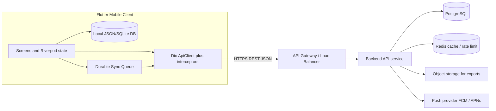
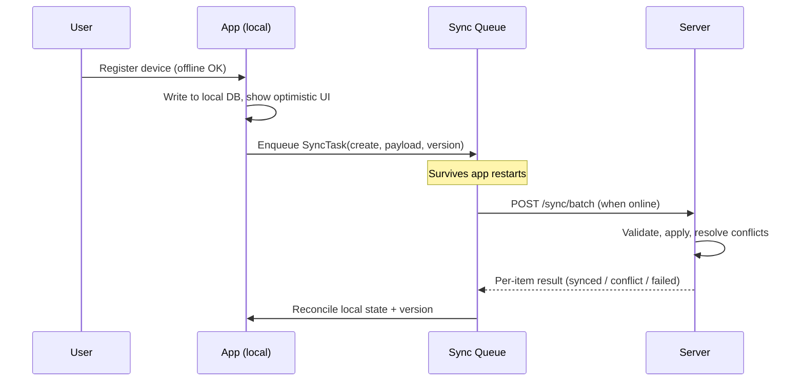
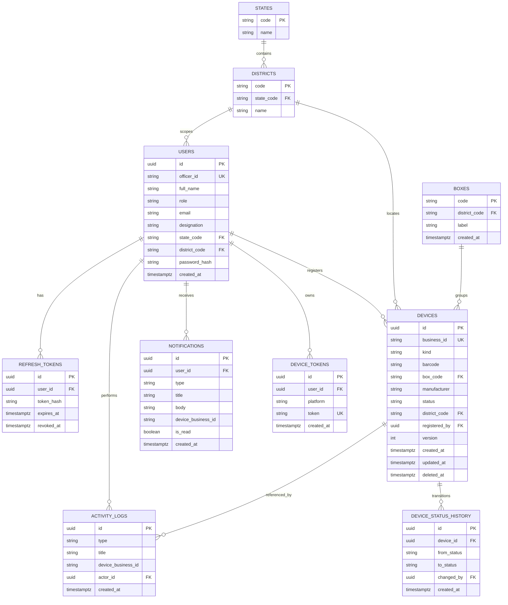

# EVM Management System — Backend & API Specification

> Source-of-truth specification for the backend that powers the EVM Management System mobile app.
> Written for the backend engineering team, database administrators, and the solution architect.
> The contracts below are reverse-engineered from the existing Flutter client so the server can be
> built to match exactly, with nothing left to guess.

- Document version: 1.0
- Status: Draft for implementation
- Last updated: 2026-06-19
- Owners: Solution Architect, Backend Lead, DBA

---

## Table of Contents

1. [Overview, Goals & Glossary](#1-overview-goals--glossary)
2. [System Architecture & Offline-First Data Flow](#2-system-architecture--offline-first-data-flow)
3. [Recommended Technology Stack](#3-recommended-technology-stack)
4. [API Conventions](#4-api-conventions)
5. [Data Model — PostgreSQL Schema & ER Diagram](#5-data-model--postgresql-schema--er-diagram)
6. [API Reference](#6-api-reference)
7. [Offline Sync Protocol](#7-offline-sync-protocol)
8. [Roles & Permissions Matrix](#8-roles--permissions-matrix)
9. [Non-Functional Requirements & Security](#9-non-functional-requirements--security)
10. [Environment / Configuration Matrix](#10-environment--configuration-matrix)
11. [Future Scope & Roadmap](#11-future-scope--roadmap)
12. [Appendix](#12-appendix)

---

## 1. Overview, Goals & Glossary

### 1.1 Purpose
The EVM Management System is an offline-first mobile application used by election officers to
register, track, audit, and synchronise Electronic Voting Machine (EVM) hardware — primarily
**Control Units (CU)** and **Ballot Units (BU)** — across states and districts.

This document defines the **backend services and HTTP API** that the existing mobile client
consumes. The client already declares the exact endpoints, request shapes, response envelopes,
and the offline-sync contract; this spec formalises them and prescribes the database design,
security, and roadmap so a backend team can implement start-to-end without ambiguity.

### 1.2 Design Goals
- **Offline-first**: every mutation works without connectivity and reconciles later via a durable
  sync queue. The server must support idempotent replays and conflict resolution.
- **Auditability**: every meaningful action (register, scan, update, sync, login) is logged and
  immutable for compliance.
- **Role-based access**: nationwide, state, district, warehouse, and auditor scopes.
- **Contract stability**: response envelopes and field names match the client DTOs to avoid
  breaking changes.
- **Security**: JWT auth, refresh rotation, TLS + certificate pinning, RBAC, rate limiting.

### 1.3 Glossary
| Term | Meaning |
|------|---------|
| CU | Control Unit — the EVM component operated by the polling officer. |
| BU | Ballot Unit — the EVM component the voter uses to cast a vote. |
| Device | Generic term covering both CU and BU. |
| Officer | An authenticated user (election/warehouse/audit staff). |
| Box / Case | Physical container (e.g. `BX-DEL-001`) that groups devices for transport/storage. |
| District / State | Administrative geography that scopes data access. |
| Manufacturer | Device maker — `BEL` (Bharat Electronics) or `ECIL`. |
| Sync task | A durable, queued local mutation awaiting upload to the server. |
| Audit/Activity event | An immutable record of an action performed in the system. |
| Business ID | Human-readable device id, e.g. `CU-2026-001`. |

### 1.4 Device lifecycle (status)
A device moves through the following statuses (mirrors the client `DeviceStatus` enum):

- `registered` — verified and active in inventory.
- `pending` — registered locally / awaiting server confirmation or approval.
- `in_transit` — moving between locations.
- `defective` — flagged faulty, needs review.

---

## 2. System Architecture & Offline-First Data Flow

### 2.1 High-level architecture



### 2.2 Offline-first write path
Every mutation is written locally first, enqueued, and replayed when online. The server must treat
replays idempotently (see Section 7).



### 2.3 Read path
Reads hit REST endpoints directly; the client caches the last successful response and falls back to
that cache when offline (e.g. dashboard summary). The server should send strong, consistent
representations and support `ETag`/`If-None-Match` where cheap.

### 2.4 Client building blocks the server must satisfy
- `ApiClient` (Dio) attaches `Authorization: Bearer`, retries idempotent calls, and refreshes tokens
  on 401 via `/auth/refresh` (see `lib/core/network/api_client.dart` and interceptors).
- A durable FIFO `SyncQueue` persists `SyncTask`s (`lib/core/sync/sync_queue.dart`).
- A `SyncManager` replays tasks on an interval (`SYNC_INTERVAL_SECONDS`) with bounded retries
  (`SYNC_MAX_RETRY`) and a `ConflictResolver`.

---

## 3. Recommended Technology Stack

The client is REST/JSON over HTTPS with JWT; the backend should match that contract. The choices
below are recommendations with rationale and viable alternatives.

### 3.1 Recommendation
- **API style**: REST/JSON over HTTPS. (The client uses Dio REST and a fixed endpoint registry.)
- **Runtime/framework**: **Node.js 20 + NestJS (TypeScript)**. Rationale: first-class DTO validation
  (`class-validator`), modular RBAC guards, OpenAPI generation, strong typing that mirrors the
  client models. 
- **Database**: **PostgreSQL 15+**. Rationale: relational integrity for inventory + audit, `JSONB`
  for flexible sync payloads, partial/expression indexes, sequences for human-readable IDs, robust
  backups and PITR.
- **Auth**: JWT access token (~60 min) + rotating refresh token (server-side store, revocable).
- **Cache / rate-limit / idempotency**: Redis.
- **Object storage**: S3-compatible (report exports, future bulk imports).
- **Push**: FCM (Android) + APNs (iOS) via a notifications service.
- **Migrations**: Prisma Migrate or TypeORM migrations (versioned, reviewed).
- **API docs**: OpenAPI 3.1 generated from code; this markdown stays the human-readable contract.

### 3.2 Alternatives (documented trade-offs)
| Concern | Recommended | Alternative(s) | Trade-off |
|---------|-------------|----------------|-----------|
| Framework | NestJS (Node/TS) | Spring Boot (Java), Django REST (Python) | All fine; pick by team skill. NestJS aligns typing with the TS-like client DTOs. |
| Database | PostgreSQL | MySQL/MariaDB | Postgres has better `JSONB`, partial indexes, exclusion constraints. |
| Fast MVP | Self-hosted Postgres + service | Supabase / Firebase | Faster bootstrap but less control over RBAC, audit immutability, and the custom `/sync/batch` contract. |
| Realtime (future) | WebSocket/SSE | Polling | Polling is simplest; realtime improves UX for multi-officer sites. |

---

## 4. API Conventions

### 4.1 Base URL & versioning
- The base URL is supplied per environment via the `API_BASE_URL` env key and **already includes the
  version prefix**. Example (dev): `https://dev-api.evm.eci.gov.in/api/v1`.
- All relative paths in this document are appended to that base (e.g. `POST /auth/login` →
  `.../api/v1/auth/login`). The relative paths match `lib/core/network/api_endpoints.dart`.
- Breaking changes bump the prefix (`/api/v2`). Additive changes do not.

### 4.2 Standard response envelope
Every JSON response uses one envelope. The client already unwraps a `data` object (see
`AuthResponseModel`/`DashboardSummaryModel` which read `json['data'] ?? json`).

Success:
```json
{
  "success": true,
  "data": { },
  "meta": { "pagination": { "page": 1, "pageSize": 20, "total": 134, "totalPages": 7 } },
  "error": null
}
```

Error:
```json
{
  "success": false,
  "data": null,
  "meta": null,
  "error": {
    "code": "VALIDATION_ERROR",
    "message": "Barcode is required.",
    "details": [ { "field": "barcode", "issue": "required" } ]
  }
}
```

- List endpoints put the array in `data` and pagination in `meta.pagination`.
- Single-resource endpoints put the object in `data`.

### 4.3 Authentication header
- Authenticated requests: `Authorization: Bearer <accessToken>`.
- Unauthenticated routes: `/auth/login`, `/auth/refresh` (refresh uses the refresh token in the body
  or a secure cookie). The client marks these with `unauthenticatedOptions`.
- On `401`, the client calls `/auth/refresh` once and retries the original request; on repeated
  failure it emits a session-expired event and forces logout.

### 4.4 Common headers
| Header | Direction | Purpose |
|--------|-----------|---------|
| `Authorization` | request | Bearer access token. |
| `Accept-Language` | request | `en` or `hi` (client supports both locales). |
| `Idempotency-Key` | request | Dedupe for create/sync operations (UUID). |
| `X-Client-Version` | request | App version for support/diagnostics. |
| `X-Request-Id` | both | Correlation id (echo back for tracing). |
| `ETag` / `If-None-Match` | both | Conditional GET caching where supported. |

### 4.5 Pagination, filtering, sorting
- Pagination: `?page=1&pageSize=20` (default `pageSize=20`, max `100`). Cursor pagination
  (`?cursor=...`) is acceptable for very large lists; document which per endpoint.
- Sorting: `?sort=-createdAt` (prefix `-` for descending). Default `-createdAt`.
- Filtering: explicit query params per endpoint (e.g. `status`, `district`, `kind`, `from`, `to`).
- Free-text search: `?q=` (case-insensitive, matches id/barcode/box/officer/district — mirrors the
  client `search()` behaviour).

### 4.6 Dates, IDs, casing
- All timestamps are **ISO-8601 UTC** strings (e.g. `2026-06-19T09:32:00Z`). The client parses ISO-8601.
- Field casing is **camelCase** in JSON. (The client tolerates snake_case fallbacks but camelCase is canonical.)
- Resource ids: UUID v4 primary keys internally; the client primarily references **business IDs**
  (`CU-2026-001`). Endpoints that take `{id}` accept the business ID.

### 4.7 HTTP status codes
| Status | When |
|--------|------|
| 200 OK | Successful read/update. |
| 201 Created | Resource created. |
| 202 Accepted | Sync batch accepted for processing (if async). |
| 204 No Content | Logout, delete with no body. |
| 400 Bad Request | Malformed JSON / bad params. |
| 401 Unauthorized | Missing/expired token. |
| 403 Forbidden | Authenticated but role not allowed. |
| 404 Not Found | Unknown resource. |
| 409 Conflict | Version/sync conflict, duplicate barcode. |
| 422 Unprocessable Entity | Validation failed. |
| 429 Too Many Requests | Rate limited. |
| 500 / 503 | Server / dependency failure. |

### 4.8 Canonical error codes
`AUTH_INVALID_CREDENTIALS`, `AUTH_TOKEN_EXPIRED`, `AUTH_REFRESH_INVALID`, `FORBIDDEN_ROLE`,
`VALIDATION_ERROR`, `RESOURCE_NOT_FOUND`, `DUPLICATE_BARCODE`, `SYNC_CONFLICT`,
`SYNC_VERSION_STALE`, `RATE_LIMITED`, `INTERNAL_ERROR`, `SERVICE_UNAVAILABLE`.

### 4.9 Idempotency
- Create and sync operations are idempotent by key:
  - REST creates: client sends `Idempotency-Key` (UUID); server stores key→result for 24h and
    returns the original result on replay.
  - Sync: each `SyncTask.id` + `entityId` is the dedupe key. Re-applying a synced task is a no-op
    that returns the current server state.

---

## 5. Data Model — PostgreSQL Schema & ER Diagram

### 5.1 Design decisions (DBA notes)
- **Unified `devices` table** with a `kind` column (`control_unit` | `ballot_unit`) is recommended
  over two near-identical tables: both CU and BU share the same attributes (barcode, box,
  manufacturer, status, district, officer, timestamps). This avoids duplicated logic, indexes, and
  triggers. The client's `/control-units` and `/ballot-units` paths are served by filtering on
  `kind` (see Section 6.3), so nothing breaks.
- **Two ids per device**: an internal `id UUID` primary key plus a human-readable, unique
  `business_id` (`CU-2026-001`). The business id is what the client shows/links.
- **Per-(kind, year) sequence** generates the numeric suffix of the business id atomically.
- **Optimistic concurrency** via an integer `version` column (mirrors `SyncTask.version`). Updates
  must send the expected version; mismatch → `409 SYNC_VERSION_STALE`.
- **Soft delete** via `deleted_at` so audit history is preserved.
- **Append-only audit**: `activity_logs` is insert-only (no updates/deletes) for compliance.
- **Geo scoping**: `state_code` / `district_code` on users and devices to enforce row-level access.

### 5.2 ER diagram



### 5.3 DDL

```sql
-- Enums
CREATE TYPE device_kind   AS ENUM ('control_unit', 'ballot_unit');
CREATE TYPE device_status AS ENUM ('registered', 'pending', 'in_transit', 'defective');
CREATE TYPE user_role     AS ENUM ('super_admin','state_officer','district_officer','warehouse_officer','auditor');
CREATE TYPE activity_type AS ENUM ('registered','scanned','updated','login','sync','exported');
CREATE TYPE notif_type    AS ENUM ('alert','success','warning','info');

-- Geography (master data)
CREATE TABLE states (
    code  TEXT PRIMARY KEY,            -- e.g. 'DL'
    name  TEXT NOT NULL
);

CREATE TABLE districts (
    code        TEXT PRIMARY KEY,      -- e.g. 'DL-CENTRAL'
    state_code  TEXT NOT NULL REFERENCES states(code),
    name        TEXT NOT NULL
);

-- Users / officers
CREATE TABLE users (
    id             UUID PRIMARY KEY DEFAULT gen_random_uuid(),
    officer_id     TEXT NOT NULL UNIQUE,           -- e.g. 'ECI-DEL-2024-0147'
    full_name      TEXT NOT NULL,
    role           user_role NOT NULL,
    email          TEXT,
    designation    TEXT,
    state_code     TEXT REFERENCES states(code),
    district_code  TEXT REFERENCES districts(code),
    password_hash  TEXT NOT NULL,                  -- Argon2id / bcrypt
    is_active      BOOLEAN NOT NULL DEFAULT TRUE,
    last_login_at  TIMESTAMPTZ,
    created_at     TIMESTAMPTZ NOT NULL DEFAULT now(),
    updated_at     TIMESTAMPTZ NOT NULL DEFAULT now()
);

-- Refresh tokens (rotating, revocable)
CREATE TABLE refresh_tokens (
    id          UUID PRIMARY KEY DEFAULT gen_random_uuid(),
    user_id     UUID NOT NULL REFERENCES users(id) ON DELETE CASCADE,
    token_hash  TEXT NOT NULL,                     -- store hash, never the raw token
    user_agent  TEXT,
    issued_at   TIMESTAMPTZ NOT NULL DEFAULT now(),
    expires_at  TIMESTAMPTZ NOT NULL,
    revoked_at  TIMESTAMPTZ
);
CREATE INDEX idx_refresh_user ON refresh_tokens(user_id) WHERE revoked_at IS NULL;

-- Boxes / cases
CREATE TABLE boxes (
    code           TEXT PRIMARY KEY,               -- e.g. 'BX-DEL-001'
    district_code  TEXT REFERENCES districts(code),
    label          TEXT,
    created_at     TIMESTAMPTZ NOT NULL DEFAULT now()
);

-- Devices (unified CU + BU)
CREATE TABLE devices (
    id             UUID PRIMARY KEY DEFAULT gen_random_uuid(),
    business_id    TEXT NOT NULL UNIQUE,           -- 'CU-2026-001'
    kind           device_kind NOT NULL,
    barcode        TEXT NOT NULL,
    box_code       TEXT REFERENCES boxes(code),
    manufacturer   TEXT NOT NULL DEFAULT 'BEL',    -- 'BEL' | 'ECIL'
    status         device_status NOT NULL DEFAULT 'pending',
    district_code  TEXT REFERENCES districts(code),
    registered_by  UUID REFERENCES users(id),
    officer_name   TEXT,                           -- denormalised for fast display
    version        INTEGER NOT NULL DEFAULT 1,     -- optimistic concurrency
    created_at     TIMESTAMPTZ NOT NULL DEFAULT now(),
    updated_at     TIMESTAMPTZ NOT NULL DEFAULT now(),
    deleted_at     TIMESTAMPTZ
);
-- A barcode is unique among non-deleted devices.
CREATE UNIQUE INDEX uq_devices_barcode_active ON devices(barcode) WHERE deleted_at IS NULL;
CREATE INDEX idx_devices_kind_status ON devices(kind, status) WHERE deleted_at IS NULL;
CREATE INDEX idx_devices_district    ON devices(district_code) WHERE deleted_at IS NULL;
CREATE INDEX idx_devices_box         ON devices(box_code);
CREATE INDEX idx_devices_created     ON devices(created_at DESC);
-- Trigram index to back free-text search on id/barcode.
CREATE EXTENSION IF NOT EXISTS pg_trgm;
CREATE INDEX idx_devices_search ON devices USING gin (
    (business_id || ' ' || barcode || ' ' || coalesce(box_code,'') || ' ' || coalesce(officer_name,'')) gin_trgm_ops
);

-- Per (kind, year) human-readable id sequence
CREATE TABLE device_id_counters (
    kind  device_kind NOT NULL,
    year  INTEGER NOT NULL,
    seq   INTEGER NOT NULL DEFAULT 0,
    PRIMARY KEY (kind, year)
);

-- Status transition history
CREATE TABLE device_status_history (
    id           UUID PRIMARY KEY DEFAULT gen_random_uuid(),
    device_id    UUID NOT NULL REFERENCES devices(id) ON DELETE CASCADE,
    from_status  device_status,
    to_status    device_status NOT NULL,
    changed_by   UUID REFERENCES users(id),
    created_at   TIMESTAMPTZ NOT NULL DEFAULT now()
);
CREATE INDEX idx_status_hist_device ON device_status_history(device_id, created_at);

-- Append-only audit / activity log
CREATE TABLE activity_logs (
    id                  UUID PRIMARY KEY DEFAULT gen_random_uuid(),
    type                activity_type NOT NULL,
    title               TEXT NOT NULL,
    device_business_id  TEXT,                       -- nullable (e.g. login)
    actor_id            UUID REFERENCES users(id),
    actor_name          TEXT,
    district_code       TEXT REFERENCES districts(code),
    metadata            JSONB,
    created_at          TIMESTAMPTZ NOT NULL DEFAULT now()
);
CREATE INDEX idx_activity_created ON activity_logs(created_at DESC);
CREATE INDEX idx_activity_device  ON activity_logs(device_business_id);
CREATE INDEX idx_activity_actor   ON activity_logs(actor_id);

-- Notifications (per user)
CREATE TABLE notifications (
    id                  UUID PRIMARY KEY DEFAULT gen_random_uuid(),
    user_id             UUID REFERENCES users(id) ON DELETE CASCADE,
    type                notif_type NOT NULL,
    title               TEXT NOT NULL,
    body                TEXT,
    device_business_id  TEXT,
    is_read             BOOLEAN NOT NULL DEFAULT FALSE,
    created_at          TIMESTAMPTZ NOT NULL DEFAULT now()
);
CREATE INDEX idx_notif_user_unread ON notifications(user_id, is_read, created_at DESC);

-- Push tokens
CREATE TABLE device_tokens (
    id          UUID PRIMARY KEY DEFAULT gen_random_uuid(),
    user_id     UUID NOT NULL REFERENCES users(id) ON DELETE CASCADE,
    platform    TEXT NOT NULL,        -- 'android' | 'ios'
    token       TEXT NOT NULL UNIQUE,
    created_at  TIMESTAMPTZ NOT NULL DEFAULT now()
);

-- Server-side sync ledger for idempotency + delta pulls
CREATE TABLE sync_log (
    task_id      TEXT PRIMARY KEY,    -- equals client SyncTask.id (dedupe key)
    entity_type  TEXT NOT NULL,
    entity_id    TEXT NOT NULL,
    operation    TEXT NOT NULL,       -- 'create' | 'update' | 'delete'
    result       TEXT NOT NULL,       -- 'synced' | 'conflict' | 'failed'
    server_version INTEGER,
    processed_at TIMESTAMPTZ NOT NULL DEFAULT now()
);
CREATE INDEX idx_sync_entity ON sync_log(entity_type, entity_id);
```

### 5.4 Business-ID generation (atomic)
```sql
-- Returns the next id like 'CU-2026-001'. Call inside the create transaction.
CREATE OR REPLACE FUNCTION next_business_id(p_kind device_kind)
RETURNS TEXT AS $$
DECLARE
    v_year  INTEGER := EXTRACT(YEAR FROM now());
    v_seq   INTEGER;
    v_prefix TEXT := CASE WHEN p_kind = 'control_unit' THEN 'CU' ELSE 'BU' END;
BEGIN
    INSERT INTO device_id_counters(kind, year, seq) VALUES (p_kind, v_year, 1)
    ON CONFLICT (kind, year) DO UPDATE SET seq = device_id_counters.seq + 1
    RETURNING seq INTO v_seq;
    RETURN v_prefix || '-' || v_year || '-' || lpad(v_seq::text, 3, '0');
END;
$$ LANGUAGE plpgsql;
```

### 5.5 Mapping: client model → DB column
| Client `DeviceRecord` field | DB column | Notes |
|------------------------------|-----------|-------|
| `id` | `devices.business_id` | e.g. `CU-2026-001`. |
| `barcode` | `devices.barcode` | unique among active. |
| `box` | `devices.box_code` | FK to `boxes`; `'Unassigned'` allowed as sentinel or null. |
| `kind` | `devices.kind` | enum. |
| `manufacturer` | `devices.manufacturer` | `BEL`/`ECIL`. |
| `status` | `devices.status` | enum; client `in_transit` ↔ `inTransit`. |
| `district` | `devices.district_code` (+ join name) | client shows code/name. |
| `officer` | `devices.officer_name` / `registered_by` | denormalised name + FK. |
| `timestamp` | `devices.created_at` | ISO-8601 UTC. |

---

## 6. API Reference

Conventions for this section: every endpoint lists method + path, auth/roles, parameters, an example
request, and an example success response. All responses use the envelope from Section 4.2 (only the
`data` payload is shown for brevity unless an error is being illustrated). Relative paths match
`lib/core/network/api_endpoints.dart`.

Endpoint index:
- Auth: `POST /auth/login`, `POST /auth/refresh`, `POST /auth/logout`, `GET /auth/profile`
- Dashboard: `GET /dashboard/summary`, `GET /dashboard/recent-activity`
- Devices: `GET /control-units`, `GET /ballot-units`, `GET /{kind}/{id}`, `POST`, `PATCH`, `DELETE`, `GET /{kind}/{id}/timeline`
- Stock register: `GET /stock-register`
- Search: `GET /search`
- Sync: `POST /sync/batch`, `GET /sync/changes`
- Notifications: `GET /notifications`, `PATCH /notifications/{id}/read`, `POST /notifications/read-all`, `POST /notifications/register-device`
- Audit: `GET /audit-trail`, `GET /audit-trail/export`
- Reports: `GET /reports/overview`, `GET /reports/daily`, `GET /reports/weekly`, `GET /reports/by-district`, `GET /reports/export`
- Reference: `GET /reference/states`, `GET /reference/districts`, `GET /reference/boxes`, `GET /reference/manufacturers`

### 6.1 Auth

#### POST /auth/login
- Auth: none.
- Body:
```json
{ "officerId": "ECI-DEL-2024-0147", "password": "••••••••" }
```
- 200 response `data`:
```json
{
  "user": {
    "id": "9f1c...uuid",
    "officerId": "ECI-DEL-2024-0147",
    "fullName": "Raj Kumar",
    "role": "district_officer",
    "email": "raj.kumar@eci.gov.in",
    "designation": "Election Officer • Grade A",
    "stateCode": "DL",
    "districtCode": "DL-CENTRAL"
  },
  "accessToken": "<jwt>",
  "refreshToken": "<opaque-or-jwt>",
  "expiresIn": 3600
}
```
- Errors: `401 AUTH_INVALID_CREDENTIALS`, `422 VALIDATION_ERROR`, `429 RATE_LIMITED`.
- Notes: `expiresIn` is seconds (client default fallback 3600). Match field names exactly
  (`accessToken`, `refreshToken`, `expiresIn`) — see `AuthResponseModel`.

#### POST /auth/refresh
- Auth: none (presents a valid refresh token).
- Body:
```json
{ "refreshToken": "<refresh-token>" }
```
- 200 response `data`: same shape as login (rotates and returns a new access + refresh token).
- Errors: `401 AUTH_REFRESH_INVALID` (expired/revoked → client forces logout).
- Behaviour: old refresh token is revoked on rotation (one active token per session).

#### POST /auth/logout
- Auth: Bearer.
- Body: none (server revokes the caller's refresh token(s)).
- 204 No Content.

#### GET /auth/profile
- Auth: Bearer.
- 200 response `data`: the `user` object (same shape as login `user`). Used by the client to
  restore a session.

### 6.2 Dashboard

#### GET /dashboard/summary
- Auth: Bearer. Role scope applies (officer sees their district unless state/super).
- Query (optional): `districtCode`, `from`, `to`.
- 200 response `data` (matches `DashboardSummaryModel`):
```json
{
  "totalControlUnits": 124,
  "totalBallotUnits": 240,
  "pendingSync": 6,
  "scannedToday": 18,
  "controlUnitsByStatus": { "registered": 90, "pending": 20, "in_transit": 8, "defective": 6 },
  "recentActivity": [
    { "id": "evt_1", "title": "Device Registered", "subtitle": "CU-2026-047 • Raj Kumar", "timestamp": "2026-06-19T09:32:00Z" }
  ],
  "weekly": {
    "controlUnits": [3, 5, 2, 8, 6, 1, 4],
    "ballotUnits": [6, 9, 4, 12, 10, 3, 7],
    "days": ["Fri","Sat","Sun","Mon","Tue","Wed","Thu"]
  }
}
```
- Notes: `weekly` powers the dashboard chart (last 7 days, oldest→newest). `controlUnitsByStatus`
  keys use the canonical status strings.

#### GET /dashboard/recent-activity
- Auth: Bearer.
- Query: `limit` (default 20), `cursor`/`page`.
- 200 response `data`: array of activity items:
```json
[
  { "id": "evt_1", "type": "registered", "title": "Device Registered", "deviceId": "CU-2026-047", "officer": "Raj Kumar", "timestamp": "2026-06-19T09:32:00Z" }
]
```

### 6.3 Devices (Control Units & Ballot Units)

Backed by the unified `devices` table. The client uses `/control-units` for CU and `/ballot-units`
for BU; the server maps each path to `kind = control_unit | ballot_unit`. The shared object schema
returned by all device endpoints:

```json
{
  "id": "CU-2026-047",
  "kind": "control_unit",
  "barcode": "4956782389",
  "box": "BX-DEL-047",
  "manufacturer": "BEL",
  "status": "registered",
  "district": "DL-CENTRAL",
  "districtName": "Delhi Central",
  "officer": "Raj Kumar",
  "registeredById": "9f1c...uuid",
  "version": 3,
  "timestamp": "2026-06-19T09:32:00Z",
  "updatedAt": "2026-06-19T10:05:00Z"
}
```

#### GET /control-units  and  GET /ballot-units
- Auth: Bearer. Role scope: results limited to the caller's district/state unless super/state.
- Query params:
  - `status` — `registered|pending|in_transit|defective` (repeatable for multiple).
  - `district` — district code.
  - `box` — box code.
  - `manufacturer` — `BEL|ECIL`.
  - `q` — free-text search (id/barcode/box/officer/district).
  - `from`, `to` — ISO-8601 created-at range.
  - `page`, `pageSize`, `sort` (default `-createdAt`).
- 200 response: `data` = array of device objects; `meta.pagination` populated.
- Example: `GET /control-units?status=pending&district=DL-CENTRAL&page=1&pageSize=20`

#### GET /control-units/{id}  and  GET /ballot-units/{id}
- Auth: Bearer.
- Path: `{id}` = business id (`CU-2026-047`).
- 200 response `data`: single device object. `404 RESOURCE_NOT_FOUND` if missing.

#### POST /control-units  and  POST /ballot-units  (register a device)
- Auth: Bearer. Roles: `super_admin`, `state_officer`, `district_officer`, `warehouse_officer`.
- Headers: `Idempotency-Key` (recommended).
- Body (server assigns `id`/business id, `version=1`, `timestamp`):
```json
{
  "barcode": "4956782389",
  "box": "BX-DEL-047",
  "manufacturer": "BEL",
  "district": "DL-CENTRAL",
  "status": "pending"
}
```
- 201 response `data`: the created device object (including generated `id`).
- Errors: `409 DUPLICATE_BARCODE`, `422 VALIDATION_ERROR`.
- Side effects: writes a `device_status_history` row and an `activity_logs` row
  (`type=registered`, `title="Device Registered"`).

#### PATCH /control-units/{id}  and  PATCH /ballot-units/{id}  (update)
- Auth: Bearer. Roles: inventory managers (see matrix).
- Body (all optional; send `version` for optimistic concurrency):
```json
{ "status": "in_transit", "box": "BX-DEL-050", "version": 3 }
```
- 200 response `data`: updated device (with incremented `version`).
- Errors: `409 SYNC_VERSION_STALE` (version mismatch), `404`, `422`.
- Side effects: status changes append `device_status_history` + `activity_logs` (`type=updated`).

#### DELETE /control-units/{id}  and  DELETE /ballot-units/{id}
- Auth: Bearer. Roles: `super_admin`, `state_officer` (configurable).
- Behaviour: **soft delete** (`deleted_at = now()`), preserves audit.
- 204 No Content.

#### GET /control-units/{id}/timeline  (device history)
- Auth: Bearer.
- 200 response `data`: chronological events for the device (status history + activity log),
  newest first — powers the Device Detail timeline:
```json
[
  { "title": "Device Registered", "officer": "Raj Kumar", "timestamp": "2026-06-19T09:32:00Z" },
  { "title": "Status changed to in_transit", "officer": "Sunita Rao", "timestamp": "2026-06-19T11:00:00Z" }
]
```

### 6.4 Stock Register

#### GET /stock-register
- Auth: Bearer.
- Query: `district` (optional), `q` (optional search for the recent list).
- 200 response `data` — aggregated inventory used by the Master Stock Register screen:
```json
{
  "totals": { "total": 364, "active": 280, "pending": 26, "defective": 6, "inTransit": 12, "registered": 268 },
  "categories": [
    { "kind": "control_unit", "total": 124, "registered": 96, "pending": 12, "inTransit": 10, "defective": 6 },
    { "kind": "ballot_unit",  "total": 240, "registered": 172, "pending": 14, "inTransit": 2, "defective": 0 }
  ],
  "recent": [
    { "id": "CU-2026-047", "kind": "control_unit", "barcode": "4956782389", "box": "BX-DEL-047", "status": "registered" }
  ]
}
```
- Notes: `categories[].registered/total` drive the per-category progress bars; `recent` is the
  latest devices (or search results when `q` is present).

### 6.5 Universal Search

#### GET /search
- Auth: Bearer.
- Query:
  - `q` (required) — matches device id, barcode, box, officer, district (case-insensitive).
  - `type` — `all|control_unit|ballot_unit|box|officer` (mirrors the client filter chips).
  - `page`, `pageSize`.
- 200 response `data`: array of device objects (same schema as Section 6.3) with `meta.pagination`.
- Empty `q` → `400 VALIDATION_ERROR` or empty array (client treats empty query as "no results").
- Notes: recent searches are stored client-side only; no server endpoint is required. A future
  `GET/POST /search/recent` could persist them per user (see roadmap).

### 6.6 Sync (offline batch upload + delta pull)
See Section 7 for the full protocol; the endpoints are listed here for the index.

#### POST /sync/batch
Uploads an ordered array of `SyncTask`s. Per-item results. See Section 7.2.

#### GET /sync/changes?since={iso}
Returns server-side changes since a timestamp/cursor for delta pull. See Section 7.4.

---

## 7. Offline Sync Protocol

This is the heart of the offline-first design. It must exactly match the client's `SyncTask`
contract (`lib/core/sync/sync_models.dart`), the durable `SyncQueue`, and the `SyncManager` retry/
conflict behaviour.

### 7.1 SyncTask contract (client → server)
Each task serialises as (from `SyncTask.toJson()`):

```json
{
  "id": "task_018f...uuid",
  "entityType": "control_unit",
  "entityId": "CU-2026-047",
  "operation": "create",
  "payload": { "barcode": "4956782389", "box": "BX-DEL-047", "manufacturer": "BEL", "district": "DL-CENTRAL", "status": "pending" },
  "endpoint": "/control-units",
  "createdAt": "2026-06-19T09:32:00Z",
  "status": "pending",
  "attempts": 0,
  "version": 0,
  "lastError": null
}
```

Field meaning:
| Field | Type | Meaning |
|-------|------|---------|
| `id` | string | Globally unique task id — **the idempotency key** (`sync_log.task_id`). |
| `entityType` | string | `control_unit` / `ballot_unit` / etc. |
| `entityId` | string | Business id of the target entity (may be a client-temp id for creates). |
| `operation` | enum | `create` / `update` / `delete`. |
| `payload` | object | Entity fields to apply. |
| `endpoint` | string | Target relative path the mutation maps to. |
| `createdAt` | ISO-8601 | Used for FIFO ordering and last-write-wins tie-breaks. |
| `version` | int | Client's last-known server version (for optimistic concurrency). |

### 7.2 POST /sync/batch
- Auth: Bearer.
- Headers: `Idempotency-Key` (per batch, optional — task `id` already dedupes per item).
- Request:
```json
{ "tasks": [ { /* SyncTask */ }, { /* SyncTask */ } ] }
```
- Processing rules:
  1. Process tasks **in `createdAt` order** (FIFO) within the batch.
  2. For each task, look up `sync_log.task_id`. If present → return the stored result (idempotent
     replay, no re-apply).
  3. Apply the mutation transactionally; resolve conflicts per Section 7.3.
  4. Record the outcome in `sync_log` and return a per-item result.
- 200 response `data`:
```json
{
  "results": [
    {
      "taskId": "task_018f...uuid",
      "entityId": "CU-2026-047",
      "status": "synced",
      "serverVersion": 1,
      "serverEntity": { "id": "CU-2026-047", "kind": "control_unit", "status": "pending", "version": 1, "timestamp": "2026-06-19T09:32:00Z" },
      "error": null
    },
    {
      "taskId": "task_019a...uuid",
      "entityId": "CU-2026-050",
      "status": "conflict",
      "serverVersion": 4,
      "serverEntity": { "id": "CU-2026-050", "status": "registered", "version": 4 },
      "error": { "code": "SYNC_VERSION_STALE", "message": "Client version 2 is behind server version 4." }
    }
  ]
}
```
- Per-item `status` ∈ `synced | conflict | failed` (maps to client `SyncStatus`). The client uses
  `serverEntity` + `serverVersion` to reconcile local state and stamp the new `version`.
- For `create` with a client-temp `entityId`, the server returns the authoritative business id in
  `serverEntity.id`; the client rewrites its local record id.

### 7.3 Conflict resolution
Strategy mirrors the client `ConflictStrategy` enum. The server evaluates the configured strategy
per entity type:

| Strategy | Behaviour |
|----------|-----------|
| `lastWriteWins` | Compare `task.createdAt` vs server `updated_at`; newer wins. Default for status/box updates. |
| `serverWins` | Server keeps its value; task returns `conflict` with `serverEntity` so client adopts it. |
| `clientWins` | Client payload overwrites server (force). Restricted to elevated roles. |
| `manual` | Server returns `conflict`; the user must resolve in a future conflict-resolution UI. |

Version handling:
- If `task.version == server.version` → apply, bump `server.version`, return `synced`.
- If `task.version < server.version` → apply the configured strategy. Under `lastWriteWins`, the
  later `createdAt`/`updated_at` wins; otherwise return `conflict` with `SYNC_VERSION_STALE`.
- `create` of an already-existing barcode → `409 DUPLICATE_BARCODE` surfaced as item `failed`
  (unless it's a replay of the same `task.id`, which returns the original `synced`).

### 7.4 Delta pull — GET /sync/changes
- Auth: Bearer.
- Query: `since` (ISO-8601 or opaque cursor from a previous response), `entityType` (optional),
  `limit` (default 200).
- 200 response `data`:
```json
{
  "changes": [
    { "entityType": "control_unit", "operation": "update", "entity": { "id": "CU-2026-047", "status": "in_transit", "version": 5 }, "updatedAt": "2026-06-19T12:00:00Z" }
  ],
  "deletions": [ { "entityType": "ballot_unit", "entityId": "BU-2026-012", "deletedAt": "2026-06-19T11:40:00Z" } ],
  "nextCursor": "2026-06-19T12:00:00Z",
  "hasMore": false
}
```
- The client applies changes whose `version` is newer than its local copy; `deletions` remove local
  rows. `nextCursor` is fed back as `since` on the next pull.

### 7.5 Retry, backoff & ordering (client behaviour the server must tolerate)
- The `SyncManager` replays the queue every `SYNC_INTERVAL_SECONDS` (default 60).
- Each task retries up to `SYNC_MAX_RETRY` (default 5) with exponential backoff; after that it is
  parked as `failed` for manual retry. The server must therefore expect duplicate `task.id`s and
  return identical results (idempotency).
- Ordering is FIFO by `createdAt`; the server must not reorder dependent tasks (e.g. create before
  update of the same entity).

---

## 6 (cont.) — Notifications, Audit, Reports & Reference Data

### 6.7 Notifications

#### GET /notifications
- Auth: Bearer. Returns notifications for the caller.
- Query: `isRead` (`true|false`), `type`, `page`, `pageSize`.
- 200 response `data`:
```json
[
  { "id": "ntf_1", "type": "warning", "title": "6 devices pending sync", "body": "Sync now to keep records current.", "deviceId": null, "isRead": false, "timestamp": "2026-06-19T08:00:00Z" },
  { "id": "ntf_2", "type": "alert", "title": "Defective device flagged", "body": "CU-2026-031 marked defective.", "deviceId": "CU-2026-031", "isRead": false, "timestamp": "2026-06-19T07:45:00Z" }
]
```
- `meta.pagination` populated; `meta.unreadCount` may be added for badge counts.
- `type` ∈ `alert|success|warning|info`. The client renders icon/colour from `type`, and taps that
  carry a `deviceId` navigate to Device Detail.

#### PATCH /notifications/{id}/read
- Auth: Bearer. Marks a single notification read. 200 with updated object.

#### POST /notifications/read-all
- Auth: Bearer. Marks all of the caller's notifications read. 204.

#### POST /notifications/register-device
- Auth: Bearer. Registers a push token (matches `ApiEndpoints.registerDevice`).
- Body:
```json
{ "platform": "android", "token": "fcm-token-..." }
```
- 201/204. Upserts into `device_tokens`. Used to deliver future push notifications.

### 6.8 Audit Trail

#### GET /audit-trail
- Auth: Bearer. Roles: any role with `canViewAudit` (auditor, super_admin, state_officer — see
  matrix). Backed by append-only `activity_logs`.
- Query: `type` (`registered|scanned|updated|login|sync|exported`), `deviceId`, `actorId`,
  `district`, `from`, `to`, `page`, `pageSize`, `sort` (default `-createdAt`).
- 200 response `data`: flat array, newest first (the client groups by day into "Today"/"Yesterday"/
  date):
```json
[
  { "id": "evt_9", "type": "sync", "title": "Synced 6 records", "deviceId": null, "officer": "Raj Kumar", "district": "DL-CENTRAL", "timestamp": "2026-06-19T12:10:00Z" },
  { "id": "evt_8", "type": "registered", "title": "Device Registered", "deviceId": "CU-2026-047", "officer": "Raj Kumar", "district": "DL-CENTRAL", "timestamp": "2026-06-19T09:32:00Z" }
]
```

#### GET /audit-trail/export
- Auth: Bearer (auditor/super_admin).
- Query: same filters + `format=csv|pdf`.
- 200: returns a download URL or streams the file:
```json
{ "url": "https://.../exports/audit-2026-06-19.csv", "expiresAt": "2026-06-19T13:00:00Z" }
```
- Generates an `activity_logs` entry with `type=exported`.

### 6.9 Reports / Analytics
All report endpoints are read-only and respect role scope (district/state).

#### GET /reports/overview
- Query: `district`, `from`, `to`.
- 200 response `data`: headline KPIs used by the Reports screen:
```json
{
  "totalDevices": 364,
  "registeredThisWeek": 42,
  "pending": 26,
  "defective": 6,
  "statusBreakdown": { "registered": 268, "pending": 26, "in_transit": 12, "defective": 6 },
  "kindBreakdown": { "control_unit": 124, "ballot_unit": 240 }
}
```

#### GET /reports/daily
- Query: `from`, `to` (default last 7 or 30 days), `district`.
- 200 response `data`: daily registration counts (bar chart):
```json
{ "labels": ["Jun 13","Jun 14","Jun 15","Jun 16","Jun 17","Jun 18","Jun 19"], "controlUnits": [3,5,2,8,6,1,4], "ballotUnits": [6,9,4,12,10,3,7] }
```

#### GET /reports/weekly
- Query: `weeks` (default 8), `district`.
- 200 response `data`: weekly totals trend (line chart):
```json
{ "labels": ["W18","W19","W20","W21","W22","W23","W24","W25"], "totals": [40, 55, 48, 62, 70, 58, 66, 74] }
```

#### GET /reports/by-district
- Query: `state`, `from`, `to`.
- 200 response `data`: distribution by district (bar/pie):
```json
[ { "district": "DL-CENTRAL", "name": "Delhi Central", "total": 142 }, { "district": "DL-SOUTH", "name": "Delhi South", "total": 98 } ]
```

#### GET /reports/export
- Query: `report` (`overview|daily|weekly|by-district`), filters, `format=csv|pdf`.
- 200 response `data`: `{ "url": "...", "expiresAt": "..." }`. Logs `type=exported`.

### 6.10 Reference / Master Data
Read-only lookups that populate dropdowns and chips. Cacheable (`ETag`, long `Cache-Control`).

#### GET /reference/states
- 200 `data`: `[ { "code": "DL", "name": "Delhi" }, { "code": "MH", "name": "Maharashtra" } ]`

#### GET /reference/districts
- Query: `state` (optional filter).
- 200 `data`: `[ { "code": "DL-CENTRAL", "name": "Delhi Central", "stateCode": "DL" } ]`

#### GET /reference/boxes
- Query: `district` (optional).
- 200 `data`: `[ { "code": "BX-DEL-047", "districtCode": "DL-CENTRAL", "label": "Central Warehouse Rack 4" } ]`

#### GET /reference/manufacturers
- 200 `data`: `[ { "code": "BEL", "name": "Bharat Electronics Ltd" }, { "code": "ECIL", "name": "Electronics Corporation of India Ltd" } ]`

---

## 8. Roles & Permissions Matrix

Roles mirror the client `UserRole` enum. Two derived capabilities drive most gates:
- `canManageInventory` = `super_admin` ∨ `state_officer` ∨ `district_officer` ∨ `warehouse_officer`.
- `canViewAudit` = `super_admin` ∨ `auditor` ∨ `state_officer`.

Data scoping (row-level) applies on top of these capabilities:
- `super_admin`: nationwide.
- `state_officer`: their `state_code`.
- `district_officer` / `warehouse_officer`: their `district_code`.
- `auditor`: read-only within their assigned scope.

| Endpoint | super_admin | state_officer | district_officer | warehouse_officer | auditor |
|----------|:----------:|:-------------:|:----------------:|:-----------------:|:-------:|
| `POST /auth/*`, `GET /auth/profile` | ✔ | ✔ | ✔ | ✔ | ✔ |
| `GET /dashboard/*` | ✔ | ✔ (state) | ✔ (district) | ✔ (district) | ✔ (read) |
| `GET /control-units`, `/ballot-units` | ✔ | ✔ | ✔ | ✔ | ✔ |
| `GET .../{id}`, `.../timeline` | ✔ | ✔ | ✔ | ✔ | ✔ |
| `POST` device (register) | ✔ | ✔ | ✔ | ✔ | ✘ |
| `PATCH` device (status/box) | ✔ | ✔ | ✔ | ✔ | ✘ |
| `DELETE` device | ✔ | ✔ | ✘ | ✘ | ✘ |
| `GET /stock-register` | ✔ | ✔ | ✔ | ✔ | ✔ |
| `GET /search` | ✔ | ✔ | ✔ | ✔ | ✔ |
| `POST /sync/batch`, `GET /sync/changes` | ✔ | ✔ | ✔ | ✔ | ✘ |
| `GET /notifications`, mark-read | ✔ | ✔ | ✔ | ✔ | ✔ |
| `POST /notifications/register-device` | ✔ | ✔ | ✔ | ✔ | ✔ |
| `GET /audit-trail`, `/audit-trail/export` | ✔ | ✔ | ✘ | ✘ | ✔ |
| `GET /reports/*`, `/reports/export` | ✔ | ✔ | ✔ (district) | ✔ (district) | ✔ |
| `GET /reference/*` | ✔ | ✔ | ✔ | ✔ | ✔ |

`✔` = allowed, `✘` = `403 FORBIDDEN_ROLE`. Scope notes in parentheses constrain which rows are
returned/affected. Enforce both capability **and** scope server-side (never trust the client).

---

## 9. Non-Functional Requirements & Security

### 9.1 Transport & certificate pinning
- HTTPS/TLS 1.2+ only. HSTS enabled.
- The client supports **SSL certificate pinning** via `ENABLE_SSL_PINNING` + `SSL_PIN_SHA256`
  (SPKI SHA-256). In UAT/prod, publish the pin(s); rotate with overlap (pin current + next cert).

### 9.2 Authentication & session
- JWT access token, ~60 min (`expiresIn`), signed RS256/ES256 (asymmetric so services can verify
  without the signing key).
- Rotating refresh tokens stored hashed in `refresh_tokens`, revocable, one active per session.
- **Idle session timeout** of `SESSION_TIMEOUT_MINUTES` (default 15) enforced client-side; the
  server should also expire refresh tokens consistent with policy.
- Logout revokes refresh tokens server-side.

### 9.3 Authorization
- RBAC guards on every route (capability) + row-level scoping (geography). Deny by default.

### 9.4 Input validation & integrity
- Validate all bodies/params (types, enums, lengths, barcode format). Reject unknown fields.
- Enforce DB constraints (unique active barcode, FK integrity, enum domains).
- Optimistic concurrency via `version` to prevent lost updates.

### 9.5 Rate limiting & abuse protection
- Per-IP + per-user limits (e.g. login 5/min/IP, general 120/min/user) → `429 RATE_LIMITED` with
  `Retry-After`. Back with Redis.
- Lockout/backoff on repeated failed logins.

### 9.6 Audit logging & data retention
- All mutations + auth events append to `activity_logs` (immutable). No hard deletes of audit rows.
- Devices use soft delete. Define retention (e.g. audit retained ≥ 7 years for election compliance);
  document purge policy for soft-deleted devices.

### 9.7 Observability
- Health endpoints: `GET /healthz` (liveness), `GET /readyz` (readiness incl. DB/Redis).
- Structured JSON logs with `X-Request-Id` correlation.
- Metrics (Prometheus): request latency, error rate, sync batch size/conflict rate, queue lag.
- Alerting on elevated 5xx, auth failures, sync conflict spikes.

### 9.8 Backups & DR
- PostgreSQL automated daily backups + WAL archiving (PITR). Test restores quarterly. Define RPO/RTO.

### 9.9 Versioning & deprecation
- URL version prefix (`/api/v1`). Additive, backward-compatible changes only within a version.
- Deprecations announced via `Deprecation`/`Sunset` headers and changelog (Appendix 12.4).

---

## 10. Environment / Configuration Matrix

These keys come from `lib/config/environment_config.dart` and the bundled `assets/env/*.env`
files. The server must honour the same base URL and timeout/sync semantics the client expects.

| Key | DEV | UAT | PROD | Notes |
|-----|-----|-----|------|-------|
| `ENVIRONMENT` | `DEV` | `UAT` | `PROD` | Banner/label + diagnostics. |
| `API_BASE_URL` | `https://dev-api.evm.eci.gov.in/api/v1` | `https://uat-api.evm.eci.gov.in/api/v1` | `https://api.evm.eci.gov.in/api/v1` | Includes version prefix. |
| `API_CONNECT_TIMEOUT_MS` | `20000` | `20000` | `15000` | Dio connect timeout. |
| `API_RECEIVE_TIMEOUT_MS` | `20000` | `20000` | `15000` | Dio receive timeout. |
| `API_SEND_TIMEOUT_MS` | `20000` | `20000` | `15000` | Dio send timeout. |
| `ENABLE_LOGGING` | `true` | `true` | `false` | Verbose client logs off in prod. |
| `ENABLE_SSL_PINNING` | `false` | `true` | `true` | Pin enforced in UAT/prod. |
| `SSL_PIN_SHA256` | *(empty)* | `<uat-spki-sha256>` | `<prod-spki-sha256>` | SPKI pin(s); rotate with overlap. |
| `SESSION_TIMEOUT_MINUTES` | `15` | `15` | `15` | Idle timeout. |
| `SYNC_INTERVAL_SECONDS` | `60` | `60` | `60` | Sync queue replay cadence. |
| `SYNC_MAX_RETRY` | `5` | `5` | `5` | Max attempts before parking a task. |

Server-side environment (not in the client `.env`, owned by backend): `DATABASE_URL`,
`REDIS_URL`, `JWT_PRIVATE_KEY`/`JWT_PUBLIC_KEY`, `JWT_ACCESS_TTL`, `JWT_REFRESH_TTL`,
`RATE_LIMIT_*`, `FCM_*`/`APNS_*`, `S3_*` (exports), `LOG_LEVEL`.

---

## 11. Future Scope & Roadmap

Phased delivery so an MVP ships fast and the platform grows safely.

### Phase 1 — MVP (build now)
- Auth (login/refresh/logout/profile), JWT + refresh rotation.
- Devices CRUD (CU/BU unified), stock register, search.
- `POST /sync/batch` + `GET /sync/changes` offline protocol with conflict resolution.
- Dashboard summary + recent activity.
- Audit trail (append-only) + notifications (in-app).
- Reference data endpoints.
- Core security: RBAC, validation, rate limiting, TLS + pinning, health checks.

### Phase 2 — Realtime & richer ops
- Real-time updates via WebSocket/SSE (live dashboard, multi-officer sites).
- Push notifications via FCM/APNs using `device_tokens`.
- CSV/PDF export for reports and audit (`/reports/export`, `/audit-trail/export`).
- Advanced search/filters (saved filters, server-persisted recent searches).
- Bulk device status transitions.

### Phase 3 — Warehouse scale & election cycle
- Bulk import / high-throughput warehouse scanning (batch register).
- Geo-tagging of devices and movements.
- Election-cycle modelling: allotment to Assembly Constituency / polling booth.
- Approvals workflow (maker-checker) for sensitive transitions.
- Analytics warehouse / data marts for heavy reporting.

### Phase 4 — Enterprise hardening
- Multi-tenant isolation (per-state data partitioning).
- SSO / officer identity integration (e.g. Aadhaar-backed officer auth).
- Tamper-evident audit (hash-chained `activity_logs`).
- Offline conflict-resolution UI backed by `manual` strategy.
- Full observability/SLA (tracing, dashboards, error budgets).

---

## 12. Appendix

### 12.1 Enum reference (canonical string values)
| Enum | Values |
|------|--------|
| `device_kind` | `control_unit`, `ballot_unit` |
| `device_status` | `registered`, `pending`, `in_transit`, `defective` |
| `user_role` | `super_admin`, `state_officer`, `district_officer`, `warehouse_officer`, `auditor` |
| `activity_type` | `registered`, `scanned`, `updated`, `login`, `sync`, `exported` |
| `notif_type` | `alert`, `success`, `warning`, `info` |
| `SyncOperation` | `create`, `update`, `delete` |
| `SyncStatus` | `pending`, `inProgress`, `failed`, `synced`, `conflict` |
| `ConflictStrategy` | `lastWriteWins`, `serverWins`, `clientWins`, `manual` |
| `manufacturer` | `BEL`, `ECIL` |

### 12.2 Canonical JSON schema examples

User:
```json
{
  "id": "uuid",
  "officerId": "ECI-DEL-2024-0147",
  "fullName": "Raj Kumar",
  "role": "district_officer",
  "email": "raj.kumar@eci.gov.in",
  "designation": "Election Officer • Grade A",
  "stateCode": "DL",
  "districtCode": "DL-CENTRAL"
}
```

Device:
```json
{
  "id": "CU-2026-047",
  "kind": "control_unit",
  "barcode": "4956782389",
  "box": "BX-DEL-047",
  "manufacturer": "BEL",
  "status": "registered",
  "district": "DL-CENTRAL",
  "districtName": "Delhi Central",
  "officer": "Raj Kumar",
  "registeredById": "uuid",
  "version": 3,
  "timestamp": "2026-06-19T09:32:00Z",
  "updatedAt": "2026-06-19T10:05:00Z"
}
```

Activity event:
```json
{ "id": "evt_8", "type": "registered", "title": "Device Registered", "deviceId": "CU-2026-047", "officer": "Raj Kumar", "district": "DL-CENTRAL", "timestamp": "2026-06-19T09:32:00Z" }
```

Error envelope:
```json
{ "success": false, "data": null, "meta": null, "error": { "code": "SYNC_VERSION_STALE", "message": "Client version 2 is behind server version 4.", "details": null } }
```

### 12.3 OpenAPI generation note
Generate OpenAPI 3.1 from the implementation (NestJS `@nestjs/swagger` decorators or equivalent).
This markdown remains the human-readable source of truth; the generated `openapi.json` is the
machine contract used for client SDKs, mock servers, and contract tests. Keep both in sync via CI.

### 12.4 Endpoint ↔ client constant cross-reference
| This doc | Client constant (`api_endpoints.dart`) |
|----------|----------------------------------------|
| `POST /auth/login` | `login` |
| `POST /auth/refresh` | `refresh` |
| `POST /auth/logout` | `logout` |
| `GET /auth/profile` | `profile` |
| `GET /dashboard/summary` | `dashboardSummary` |
| `GET /dashboard/recent-activity` | `recentActivity` |
| `GET/POST /control-units` | `controlUnits` |
| `GET/POST /ballot-units` | `ballotUnits` |
| `GET /stock-register` | `stockRegister` |
| `POST /sync/batch` | `syncBatch` |
| `GET /notifications` | `notifications` |
| `POST /notifications/register-device` | `registerDevice` |
| `GET /audit-trail` | `auditTrail` |

Endpoints in this spec without a client constant yet (`/sync/changes`, `/search`, `/reports/*`,
`/reference/*`, `/audit-trail/export`, notifications read/read-all) are **additive** — the backend
should implement them and the client can adopt them incrementally without breaking existing calls.

### 12.5 Document changelog
| Version | Date | Change |
|---------|------|--------|
| 1.0 | 2026-06-19 | Initial comprehensive specification. |

