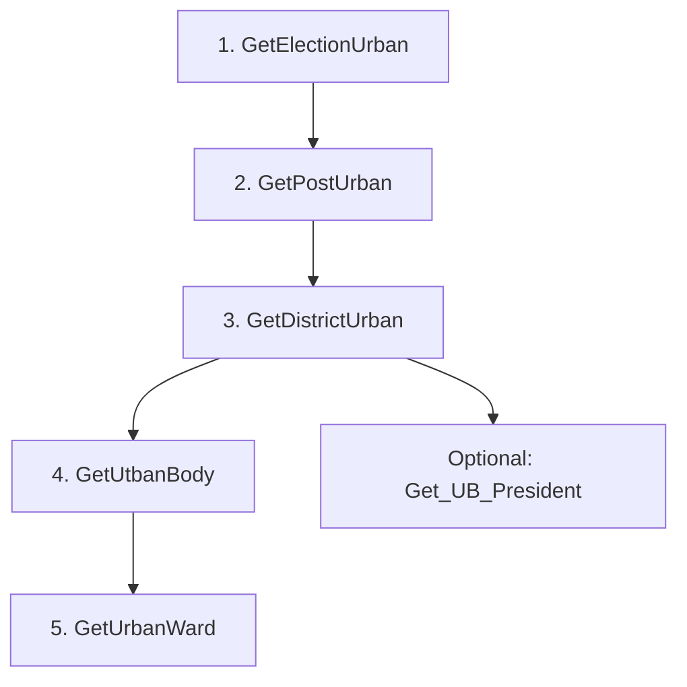

# OLINAPI — Frontend Integration Guide

**Project:** Online Nomination Module (Urban)  
**API Controller:** `MasterController`  
**Content-Type:** `application/json`  
**HTTP Method:** All documented endpoints use **GET**

This document explains how a frontend application should call the OLINAPI master lookup APIs in the correct order, handle responses, and avoid breaking the nomination selection workflow.

---

## 1. Base URLs

| Environment | Base URL |
|-------------|----------|
| Local development | `http://localhost:5013` |
| IIS production | `http://10.115.197.192/OLINAPI` |

All endpoints below are appended to the base URL.

**Examples:**
- Local: `http://localhost:5013/Master/GetElectionUrban`
- Production: `http://10.115.197.192/OLINAPI/Master/GetElectionUrban`

### Swagger (interactive testing)

| Environment | Swagger UI |
|-------------|------------|
| Local | `http://localhost:5013/swagger/index.html` |
| Production | `http://10.115.197.192/OLINAPI/swagger/index.html` |

---

## 2. General API Rules

1. All responses are JSON arrays (except error responses).
2. ASP.NET Core serializes property names in **camelCase** in JSON.
3. An empty array `[]` means **no records found** — this is not an error.
4. `400 Bad Request` returns:

```json
{
  "message": "Error description here"
}
```

5. Only **active** records are returned:
   - `Election_Master_Urban.isActive = 1` for election-linked queries
   - `Notification_Urban.IsActive = 1` for urban body and ward queries
6. No authentication header is currently required by these endpoints.
7. Use `Accept: application/json` in requests.

### JSON property name mapping

| C# Property | JSON Property (typical) |
|-------------|-------------------------|
| `Election_Id` | `election_Id` |
| `Ename` | `ename` |
| `PostID` | `postID` |
| `PostName` | `postName` |
| `DstID` | `dstID` |
| `DstName` | `dstName` |
| `UBID` | `ubID` |
| `TypeID` | `typeID` |
| `UBName` | `ubName` |
| `WardID` | `wardID` |
| `WardNO` | `wardNO` |

---

## 3. Recommended UI Workflow

The urban nomination screen should load dropdowns/lookup lists in a **cascading sequence**. Each step uses values selected in the previous step.



### Main cascading flow (recommended)

| Step | API | User selects | Pass to next step |
|------|-----|--------------|-------------------|
| 1 | `GetElectionUrban` | Election | `election_Id` |
| 2 | `GetPostUrban` | Post | `postID` |
| 3 | `GetDistrictUrban` | District | `dstID` |
| 4 | `GetUtbanBody` | Urban Body | `ubID` |
| 5 | `GetUrbanWard` | Ward | `wardID`, `wardNO` |

### Important frontend rule

When the user changes a parent dropdown, **clear and reload all child dropdowns**.

Example:
- If election changes → reset Post, District, Urban Body, Ward
- If post changes → reset District, Urban Body, Ward
- If district changes → reset Urban Body, Ward
- If urban body changes → reset Ward

---

## 4. Endpoint Reference

### 4.1 GetElectionUrban

Load the election dropdown first.

| Item | Value |
|------|-------|
| **URL** | `/Master/GetElectionUrban` |
| **Method** | GET |
| **Input** | None |

**Success response:** `200 OK`

```json
[
  {
    "election_Id": 1,
    "ename": "आम निर्वाचन-2024"
  }
]
```

| Field | Type | Description |
|-------|------|-------------|
| `election_Id` | integer | Election ID — save for next API |
| `ename` | string | Display label for dropdown |

**Frontend usage:**
- Display `ename` to the user
- Store `election_Id` as selected election

---

### 4.2 GetPostUrban

Load posts after election is selected.

| Item | Value |
|------|-------|
| **URL** | `/Master/GetPostUrban` |
| **Method** | GET |

**Query parameters:**

| Name | Type | Required | Description |
|------|------|----------|-------------|
| `electionId` | integer | Yes | Selected `election_Id` from step 1 |

**Example:**

```
GET /Master/GetPostUrban?electionId=1
```

**Success response:** `200 OK`

```json
[
  {
    "postID": 2,
    "postName": "President"
  },
  {
    "postID": 3,
    "postName": "Mayor"
  }
]
```

| Field | Type | Description |
|-------|------|-------------|
| `postID` | integer | Post ID — save for next APIs |
| `postName` | string | Display label for dropdown |

**Validation error:** `400 Bad Request`

```json
{
  "message": "ElectionID is required and must be greater than zero."
}
```

---

### 4.3 GetDistrictUrban

Load districts after election and post are selected.

| Item | Value |
|------|-------|
| **URL** | `/Master/GetDistrictUrban` |
| **Method** | GET |

**Query parameters:**

| Name | Type | Required | Description |
|------|------|----------|-------------|
| `electionId` | integer | Yes | Selected election ID |
| `postId` | integer | Yes | Selected post ID |

**Example:**

```
GET /Master/GetDistrictUrban?electionId=1&postId=3
```

**Success response:** `200 OK`

```json
[
  {
    "dstID": "13037CCE-314E-4BDB-9BA7-92D085F2CBD3",
    "dstName": "District Name"
  }
]
```

| Field | Type | Description |
|-------|------|-------------|
| `dstID` | string | District GUID/string ID |
| `dstName` | string | Display label for dropdown |

**Validation errors:** `400 Bad Request`

```json
{ "message": "ElectionID is required and must be greater than zero." }
```

```json
{ "message": "PostID is required and must be greater than zero." }
```

---

### 4.4 GetUtbanBody

Load urban bodies after post and district are selected.

> **Note:** Endpoint name is `GetUtbanBody` (as implemented in the API).

| Item | Value |
|------|-------|
| **URL** | `/Master/GetUtbanBody` |
| **Method** | GET |

**Query parameters:**

| Name | Type | Required | Description |
|------|------|----------|-------------|
| `postId` | integer | Yes | Selected post ID |
| `dstId` | string | Yes | Selected district ID |

**Example:**

```
GET /Master/GetUtbanBody?postId=2&dstId=13037CCE-314E-4BDB-9BA7-92D085F2CBD3
```

**Success response:** `200 OK`

```json
[
  {
    "ubID": "00E30953-FFE4-4D8E-A3F9-B488DB520454",
    "typeID": 1,
    "ubName": "Urban Body Name"
  }
]
```

| Field | Type | Description |
|-------|------|-------------|
| `ubID` | string | Urban body ID |
| `typeID` | integer | Urban body type ID |
| `ubName` | string | Display label for dropdown |

**Validation errors:** `400 Bad Request`

```json
{ "message": "PostID is required and must be greater than zero." }
```

```json
{ "message": "DstID is required." }
```

---

### 4.5 GetUrbanWard

Load wards after post, district, and urban body are selected.

| Item | Value |
|------|-------|
| **URL** | `/Master/GetUrbanWard` |
| **Method** | GET |

**Query parameters:**

| Name | Type | Required | Description |
|------|------|----------|-------------|
| `postId` | integer | Yes | Selected post ID |
| `dstId` | string | Yes | Selected district ID |
| `ubId` | string | Yes | Selected urban body ID |

**Example:**

```
GET /Master/GetUrbanWard?postId=3&dstId=13037CCE-314E-4BDB-9BA7-92D085F2CBD3&ubId=00E30953-FFE4-4D8E-A3F9-B488DB520454
```

**Success response:** `200 OK`

```json
[
  {
    "wardID": "A1B2C3D4-E5F6-7890-ABCD-EF1234567890",
    "wardNO": 5
  }
]
```

| Field | Type | Description |
|-------|------|-------------|
| `wardID` | string | Ward ID |
| `wardNO` | integer | Ward number for display/sorting |

**Validation errors:** `400 Bad Request`

```json
{ "message": "PostID is required and must be greater than zero." }
```

```json
{ "message": "DstID is required." }
```

```json
{ "message": "UBID is required." }
```

---

### 4.6 Get_UB_President

Optional/alternate API to fetch urban body president records.

Use this when the screen needs president-specific urban body data using district and post only.

| Item | Value |
|------|-------|
| **URL** | `/Master/Get_UB_President` |
| **Method** | GET |

**Query parameters:**

| Name | Type | Required | Description |
|------|------|----------|-------------|
| `dstId` | string | Yes | Selected district ID |
| `postId` | string | Yes | Post ID as string |

> **Important:** Unlike other endpoints, `postId` here is a **string**, not an integer.

**Example:**

```
GET /Master/Get_UB_President?dstId=13037CCE-314E-4BDB-9BA7-92D085F2CBD3&postId=2
```

**Success response:** `200 OK`

```json
[
  {
    "ubID": "00E30953-FFE4-4D8E-A3F9-B488DB520454",
    "typeID": 1,
    "ubName": "Urban Body Name"
  }
]
```

| Field | Type | Description |
|-------|------|-------------|
| `ubID` | string | Urban body ID |
| `typeID` | integer | Urban body type ID |
| `ubName` | string | Urban body name |

**Backend note for frontend team:**
- This API filters on active election (`isActive = 1`)
- Backend currently uses fixed `Election_Id = 1` internally

**Validation errors:** `400 Bad Request`

```json
{ "message": "DstID is required." }
```

```json
{ "message": "PostID is required." }
```

---

## 5. Frontend State Model

Recommended client-side state object:

```typescript
interface UrbanNominationSelection {
  electionId: number | null;
  electionName: string | null;

  postId: number | null;
  postName: string | null;

  dstId: string | null;
  dstName: string | null;

  ubId: string | null;
  ubName: string | null;
  typeId: number | null;

  wardId: string | null;
  wardNo: number | null;
}
```

---

## 6. Sample Frontend Implementation (TypeScript)

### 6.1 API service

```typescript
const API_BASE = "http://10.115.197.192/OLINAPI"; // use localhost for dev

async function getJson<T>(url: string): Promise<T> {
  const response = await fetch(url, {
    headers: { Accept: "application/json" }
  });

  if (!response.ok) {
    const error = await response.json().catch(() => ({}));
    throw new Error(error.message ?? `Request failed: ${response.status}`);
  }

  return response.json();
}

export const MasterApi = {
  getElectionUrban: () =>
    getJson<ElectionUrban[]>(`${API_BASE}/Master/GetElectionUrban`),

  getPostUrban: (electionId: number) =>
    getJson<PostUrban[]>(
      `${API_BASE}/Master/GetPostUrban?electionId=${electionId}`
    ),

  getDistrictUrban: (electionId: number, postId: number) =>
    getJson<DistrictUrban[]>(
      `${API_BASE}/Master/GetDistrictUrban?electionId=${electionId}&postId=${postId}`
    ),

  getUtbanBody: (postId: number, dstId: string) =>
    getJson<UrbanBody[]>(
      `${API_BASE}/Master/GetUtbanBody?postId=${postId}&dstId=${encodeURIComponent(dstId)}`
    ),

  getUrbanWard: (postId: number, dstId: string, ubId: string) =>
    getJson<UrbanWard[]>(
      `${API_BASE}/Master/GetUrbanWard?postId=${postId}&dstId=${encodeURIComponent(dstId)}&ubId=${encodeURIComponent(ubId)}`
    ),

  getUbPresident: (dstId: string, postId: string) =>
    getJson<UbPresident[]>(
      `${API_BASE}/Master/Get_UB_President?dstId=${encodeURIComponent(dstId)}&postId=${encodeURIComponent(postId)}`
    )
};
```

### 6.2 Type definitions

```typescript
interface ElectionUrban {
  election_Id: number;
  ename: string;
}

interface PostUrban {
  postID: number;
  postName: string;
}

interface DistrictUrban {
  dstID: string;
  dstName: string;
}

interface UrbanBody {
  ubID: string;
  typeID: number;
  ubName: string;
}

interface UrbanWard {
  wardID: string;
  wardNO: number;
}

interface UbPresident {
  ubID: string;
  typeID: number;
  ubName: string;
}
```

### 6.3 Page load sequence

```typescript
async function loadInitialData() {
  const elections = await MasterApi.getElectionUrban();
  populateDropdown("election", elections, "election_Id", "ename");
}

async function onElectionChange(electionId: number) {
  resetDropdowns(["post", "district", "urbanBody", "ward"]);

  const posts = await MasterApi.getPostUrban(electionId);
  populateDropdown("post", posts, "postID", "postName");
}

async function onPostChange(electionId: number, postId: number) {
  resetDropdowns(["district", "urbanBody", "ward"]);

  const districts = await MasterApi.getDistrictUrban(electionId, postId);
  populateDropdown("district", districts, "dstID", "dstName");
}

async function onDistrictChange(postId: number, dstId: string) {
  resetDropdowns(["urbanBody", "ward"]);

  const urbanBodies = await MasterApi.getUtbanBody(postId, dstId);
  populateDropdown("urbanBody", urbanBodies, "ubID", "ubName");
}

async function onUrbanBodyChange(postId: number, dstId: string, ubId: string) {
  resetDropdowns(["ward"]);

  const wards = await MasterApi.getUrbanWard(postId, dstId, ubId);
  populateDropdown("ward", wards, "wardID", "wardNO");
}
```

---

## 7. UI Binding Guide

| Dropdown | Value field | Display field | Loaded by |
|----------|-------------|---------------|-----------|
| Election | `election_Id` | `ename` | `GetElectionUrban` |
| Post | `postID` | `postName` | `GetPostUrban` |
| District | `dstID` | `dstName` | `GetDistrictUrban` |
| Urban Body | `ubID` | `ubName` | `GetUtbanBody` |
| Ward | `wardID` | `wardNO` | `GetUrbanWard` |

For ward dropdown, display `wardNO` to the user but store `wardID` as the selected value.

---

## 8. Error Handling Checklist

| Scenario | Expected behavior |
|----------|-------------------|
| Missing required query param | `400` with `message` |
| No matching data | `200` with `[]` |
| Invalid numeric ID (`<= 0`) | `400` with validation message |
| Network/server failure | Non-200 status; show generic error |
| GUID/string IDs | Always URL-encode using `encodeURIComponent()` |

---

## 9. Complete Request Examples

### Local

```http
GET http://localhost:5013/Master/GetElectionUrban
GET http://localhost:5013/Master/GetPostUrban?electionId=1
GET http://localhost:5013/Master/GetDistrictUrban?electionId=1&postId=3
GET http://localhost:5013/Master/GetUtbanBody?postId=2&dstId=13037CCE-314E-4BDB-9BA7-92D085F2CBD3
GET http://localhost:5013/Master/GetUrbanWard?postId=3&dstId=13037CCE-314E-4BDB-9BA7-92D085F2CBD3&ubId=00E30953-FFE4-4D8E-A3F9-B488DB520454
GET http://localhost:5013/Master/Get_UB_President?dstId=13037CCE-314E-4BDB-9BA7-92D085F2CBD3&postId=2
```

### Production

```http
GET http://10.115.197.192/OLINAPI/Master/GetElectionUrban
GET http://10.115.197.192/OLINAPI/Master/GetPostUrban?electionId=1
GET http://10.115.197.192/OLINAPI/Master/GetDistrictUrban?electionId=1&postId=3
GET http://10.115.197.192/OLINAPI/Master/GetUtbanBody?postId=2&dstId=13037CCE-314E-4BDB-9BA7-92D085F2CBD3
GET http://10.115.197.192/OLINAPI/Master/GetUrbanWard?postId=3&dstId=13037CCE-314E-4BDB-9BA7-92D085F2CBD3&ubId=00E30953-FFE4-4D8E-A3F9-B488DB520454
GET http://10.115.197.192/OLINAPI/Master/Get_UB_President?dstId=13037CCE-314E-4BDB-9BA7-92D085F2CBD3&postId=2
```

---

## 10. Endpoint Summary Table

| # | Endpoint | Required Inputs | Output Fields |
|---|----------|-----------------|---------------|
| 1 | `GetElectionUrban` | None | `election_Id` (int), `ename` (string) |
| 2 | `GetPostUrban` | `electionId` (int) | `postID` (int), `postName` (string) |
| 3 | `GetDistrictUrban` | `electionId` (int), `postId` (int) | `dstID` (string), `dstName` (string) |
| 4 | `GetUtbanBody` | `postId` (int), `dstId` (string) | `ubID` (string), `typeID` (int), `ubName` (string) |
| 5 | `GetUrbanWard` | `postId` (int), `dstId` (string), `ubId` (string) | `wardID` (string), `wardNO` (int) |
| 6 | `Get_UB_President` | `dstId` (string), `postId` (string) | `ubID` (string), `typeID` (int), `ubName` (string) |

---

## 11. Do Not Miss These Implementation Details

1. **`GetUtbanBody` spelling** — use exact route name; do not rename to `GetUrbanBody`.
2. **`Get_UB_President` uses string `postId`** — convert integer post ID to string when calling this API.
3. **GUID values must be encoded** in query strings.
4. **Always reload child dropdowns** after parent selection changes.
5. **Empty list is valid** — show "No records found" instead of treating it as API failure.
6. **Production path base** — all production URLs must include `/OLINAPI`.
7. **Swagger is available** in both local and production for live testing.

---

## 12. Suggested Screen Flow

```text
Page Load
  └─ Call GetElectionUrban
       └─ User selects Election
            └─ Call GetPostUrban(electionId)
                 └─ User selects Post
                      └─ Call GetDistrictUrban(electionId, postId)
                           └─ User selects District
                                └─ Call GetUtbanBody(postId, dstId)
                                     └─ User selects Urban Body
                                          └─ Call GetUrbanWard(postId, dstId, ubId)
                                               └─ User selects Ward
                                                    └─ Continue nomination form
```

---

**Document version:** 1.0  
**Last updated:** July 22, 2026  
**API project:** OLINAPI — Online Nomination Module
