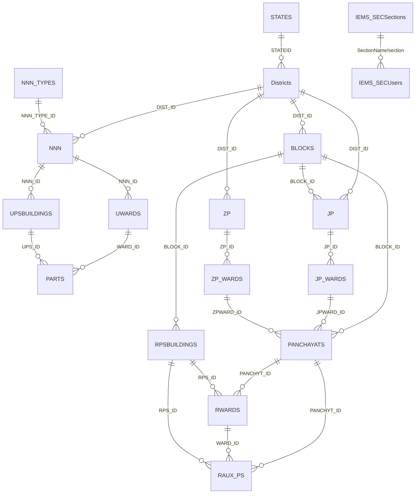

# MPSECIEMS — Schema Inspection Report & Mapping

> Source: live `information_schema` read via `survey_api/inspect.js`
> (`schema-report.json` / `schema-report.md`). **No table names assumed** —
> everything below is taken from the actual database (18 tables).

---

## 1. Findings summary

- **18 tables**, all `InnoDB`. Every table's primary key is a **`varchar(50) ID`** (surrogate string key).
- **Zero declared foreign keys.** All relationships are **implicit** via `*_ID` columns (e.g. `BLOCKS.DIST_ID`). See §4 for recommended FKs.
- Each location table stores **bilingual names**: Hindi in `*_NAME` and English in `*_NAME_EN`. The app should show Hindi (`*_NAME`) and fall back to `*_NAME_EN`.
- Denormalised numeric codes (`DIST_NO`, `BLOCK_NO`, `NNN_NO`, …) exist alongside the surrogate `ID`s — natural composite keys.
- **No survey domain tables exist** — see §5. Submit currently has **no insert destination**.

---

## 2. Master tables & columns (actual)

### Rural hierarchy
| Table | PK | Name col | Parent link (implicit FK) |
| --- | --- | --- | --- |
| `STATES` | `ID` | `STATE_NAME` | — |
| `Districts` | `ID` | `DIST_NAME` / `DIST_NAME_EN` | `STATEID → STATES.ID` |
| `BLOCKS` | `ID` | `BLOCK_NAME` / `BLOCK_NAME_EN` | `DIST_ID → Districts.ID` |
| `PANCHAYATS` | `ID` | `PANCHYT_NAME` / `PANCHYT_NAME_EN` | `BLOCK_ID → BLOCKS.ID`; `JPWARD_ID → JP_WARDS.ID`; `ZPWARD_ID → ZP_WARDS.ID` |
| `RWARDS` | `ID` | *(no name; use `WARD_NO`)* | `PANCHYT_ID → PANCHAYATS.ID`; `VILL_ID → (no VILLAGES table)`; `RPS_ID → RPSBUILDINGS.ID` |
| `RPSBUILDINGS` | `ID` | `RPSBUILDING_NAME` / `_EN` | `BLOCK_ID → BLOCKS.ID` |
| `RAUX_PS` | `ID` | *(no name; use `AUX_NO`)* | `PANCHYT_ID → PANCHAYATS.ID`; `WARD_ID → RWARDS.ID`; `RPS_ID → RPSBUILDINGS.ID` |

### Urban hierarchy
| Table | PK | Name col | Parent link (implicit FK) |
| --- | --- | --- | --- |
| `NNN_TYPES` | `ID` | `NNN_TYPE_DESC` / `_EN` | — (global body types: Nigam/Palika/Parishad) |
| `NNN` | `ID` | `NNN_NAME` / `NNN_NAME_EN` | `DIST_ID → Districts.ID`; `NNN_TYPE_ID → NNN_TYPES.ID` |
| `UWARDS` | `ID` | `WARD_NAME` / `WARD_NAME_EN` | `NNN_ID → NNN.ID` |
| `PARTS` | `ID` | `PART_NAME` / `PART_NAME_EN` | `WARD_ID → UWARDS.ID`; `UPS_ID → UPSBUILDINGS.ID` |
| `UPSBUILDINGS` | `ID` | `UPSBUILDING_NAME` / `_EN` | `NNN_ID → NNN.ID` |

### JP / ZP (panchayati-raj wards)
| Table | PK | Name col | Parent link |
| --- | --- | --- | --- |
| `JP` | `ID` | `JP_NAME` / `_EN` | `DIST_ID → Districts.ID`; `BLOCK_ID → BLOCKS.ID` |
| `JP_WARDS` | `ID` | *(use `WARD_NO`)* | `JP_ID → JP.ID` |
| `ZP` | `ID` | `ZP_NAME` / `_EN` | `DIST_ID → Districts.ID` |
| `ZP_WARDS` | `ID` | *(use `WARD_NO`)* | `ZP_ID → ZP.ID` |

### Authentication
| Table | PK | Columns |
| --- | --- | --- |
| `IEMS_SECUsers` | `ID (bigint AI)` | `section`, `SO_Name`, `userid`, `password`, `isactive` |
| `IEMS_SECSections` | `ID (bigint AI)` | `SectionName`, `isactive`, `CreatedDate` |

---

## 3. ER diagram (implicit relationships)



---

## 4. Foreign-key recommendations (currently none declared)

Add these to enforce integrity (all `ID` cols are `varchar(50)`; ensure matching charset/collation):

```sql
ALTER TABLE Districts    ADD CONSTRAINT fk_dist_state   FOREIGN KEY (STATEID)     REFERENCES STATES(ID);
ALTER TABLE BLOCKS       ADD CONSTRAINT fk_block_dist    FOREIGN KEY (DIST_ID)     REFERENCES Districts(ID);
ALTER TABLE PANCHAYATS   ADD CONSTRAINT fk_panch_block   FOREIGN KEY (BLOCK_ID)    REFERENCES BLOCKS(ID);
ALTER TABLE RWARDS       ADD CONSTRAINT fk_rward_panch   FOREIGN KEY (PANCHYT_ID)  REFERENCES PANCHAYATS(ID);
ALTER TABLE RWARDS       ADD CONSTRAINT fk_rward_rps     FOREIGN KEY (RPS_ID)      REFERENCES RPSBUILDINGS(ID);
ALTER TABLE RPSBUILDINGS ADD CONSTRAINT fk_rps_block     FOREIGN KEY (BLOCK_ID)    REFERENCES BLOCKS(ID);
ALTER TABLE RAUX_PS      ADD CONSTRAINT fk_aux_ward      FOREIGN KEY (WARD_ID)     REFERENCES RWARDS(ID);
ALTER TABLE NNN          ADD CONSTRAINT fk_nnn_dist      FOREIGN KEY (DIST_ID)     REFERENCES Districts(ID);
ALTER TABLE NNN          ADD CONSTRAINT fk_nnn_type      FOREIGN KEY (NNN_TYPE_ID) REFERENCES NNN_TYPES(ID);
ALTER TABLE UWARDS       ADD CONSTRAINT fk_uward_nnn     FOREIGN KEY (NNN_ID)      REFERENCES NNN(ID);
ALTER TABLE PARTS        ADD CONSTRAINT fk_part_uward    FOREIGN KEY (WARD_ID)     REFERENCES UWARDS(ID);
ALTER TABLE PARTS        ADD CONSTRAINT fk_part_ups      FOREIGN KEY (UPS_ID)      REFERENCES UPSBUILDINGS(ID);
ALTER TABLE UPSBUILDINGS ADD CONSTRAINT fk_ups_nnn       FOREIGN KEY (NNN_ID)      REFERENCES NNN(ID);
```
> Note: `RWARDS.VILL_ID` references a **villages** table that does **not exist** in this DB — dangling reference, flagged for clarification.

---

## 5. Survey / submission tables — STATUS: **ABSENT**

A scan of all 18 tables found **no** survey-domain tables. Specifically missing:

| Needed for | Found? |
| --- | --- |
| Survey submission (header) | ❌ none |
| Survey answer / response | ❌ none |
| Survey section | ❌ (only `IEMS_SECSections` = auth/office sections, not survey) |
| Survey question / checklist | ❌ none |
| Response→image mapping | ❌ none |

**Conclusion:** the checklist questions and the submit payload have **no insert destination today**. They must be created before submit can persist. Proposed (NEW — requires your approval, not auto-created):

```sql
-- Checklist definition
CREATE TABLE SURVEY_QUESTIONS (
  ID            VARCHAR(50)  NOT NULL PRIMARY KEY,
  QUESTION_HI   VARCHAR(255) NOT NULL,
  QUESTION_EN   VARCHAR(255) NULL,
  PHOTO_REQUIRED TINYINT(1)  NOT NULL DEFAULT 0,
  SORT_ORDER    INT          NOT NULL DEFAULT 0,
  IS_ACTIVE     TINYINT(1)   NOT NULL DEFAULT 1
);

-- Submission header (one per booth inspection)
CREATE TABLE SURVEY_SUBMISSIONS (
  ID           BIGINT       NOT NULL AUTO_INCREMENT PRIMARY KEY,
  AREA_TYPE    VARCHAR(10)  NOT NULL,           -- 'urban' | 'rural'
  DIST_ID      VARCHAR(50)  NULL,
  BLOCK_ID     VARCHAR(50)  NULL,
  PANCHYT_ID   VARCHAR(50)  NULL,
  NNN_ID       VARCHAR(50)  NULL,
  BOOTH_ID     VARCHAR(50)  NULL,               -- RPSBUILDINGS.ID or UPSBUILDINGS.ID
  LATITUDE     DECIMAL(10,7) NULL,
  LONGITUDE    DECIMAL(10,7) NULL,
  REMARKS      TEXT         NULL,
  SUBMITTED_BY BIGINT       NULL,               -- IEMS_SECUsers.ID
  CREATED_AT   DATETIME     NOT NULL DEFAULT CURRENT_TIMESTAMP
);

-- One row per checklist answer
CREATE TABLE SURVEY_ANSWERS (
  ID            BIGINT      NOT NULL AUTO_INCREMENT PRIMARY KEY,
  SUBMISSION_ID BIGINT      NOT NULL,
  QUESTION_ID   VARCHAR(50) NOT NULL,
  CHECKED       TINYINT(1)  NOT NULL DEFAULT 0,
  IMAGE         LONGTEXT    NULL,               -- base64 (or file path if stored on disk)
  CONSTRAINT fk_ans_sub FOREIGN KEY (SUBMISSION_ID) REFERENCES SURVEY_SUBMISSIONS(ID)
);
```

---

## 6. Data flow (target)

```
Login (IEMS_SECUsers.userid/password)
   └─ resolve section (IEMS_SECSections)
        └─ Location cascade (read-only masters):
             rural : Districts → BLOCKS → PANCHAYATS → [RWARDS] → RPSBUILDINGS  (मतदान केंद्र)
             urban : Districts → NNN_TYPES → NNN → UPSBUILDINGS                  (मतदान केंद्र)
                  └─ Checklist questions  (SURVEY_QUESTIONS — TO CREATE)
                       └─ Submit → INSERT SURVEY_SUBMISSIONS (header)
                                 → INSERT SURVEY_ANSWERS (per question + image)
```
```
